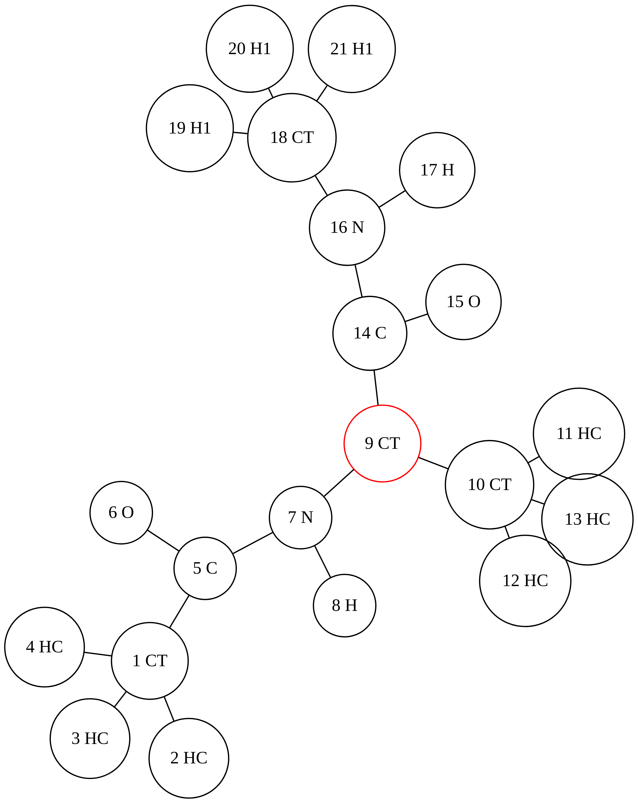

---
execute:
  echo: true
  warning: false
title: Ala topology
toc-title: Table of contents
---

# Ala

::: {.cell execution_count="1"}
``` {.python .cell-code}
from kimmdy.parsing import read_top
from kimmdy.topology.topology import Topology
from pathlib import Path
from kimmdy.misc_helper import top_to_graph
```
:::

::: {.cell execution_count="2"}
``` {.python .cell-code}
ala_top = read_top(Path('../example/example_ala/Ala_out.top'))
ffdir = Path("../tests/test_files/assets/amber99sb-star-ildnp.ff")
top = Topology(ala_top, ffdir)

ls = top_to_graph(top) 
with open("ala-top.dot", "w") as f:
  f.writelines(ls)
```
:::

::: {.cell file="ala-top.dot"}
::: cell-output-display
::: {#fig-ala}
<div>

{width="7in"
height="5in"}

</div>

Figure 1: A diagram of the ala topology
:::
:::
:::
